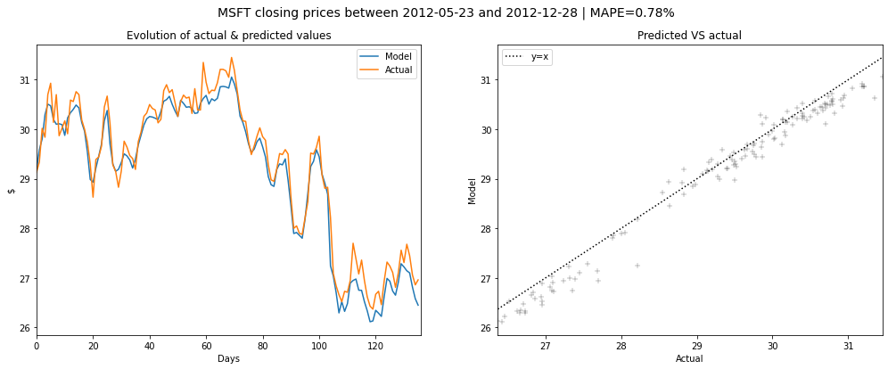
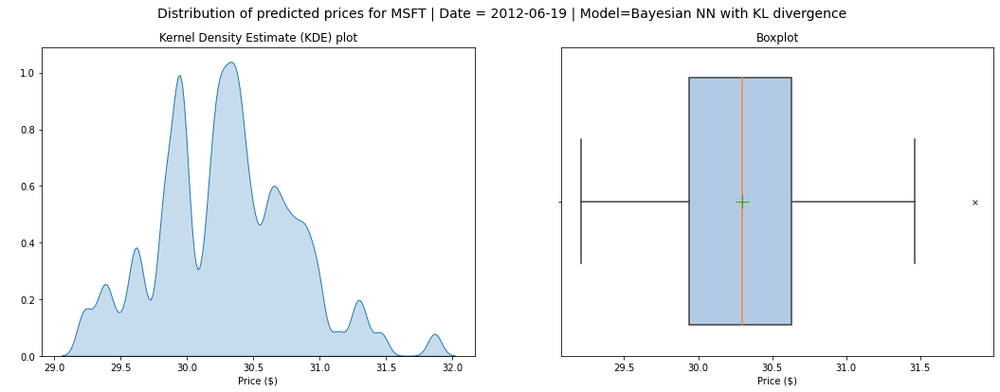

# bayesian-neural-network-stock-prediction

## Objective

Inspired by the [A Bayesian regularized artificial neural network for stock market forecasting](https://www.sciencedirect.com/science/article/pii/S0957417413002509#:~:text=In%20this%20paper%20a%20Bayesian,closing%20price%20of%20individual%20stocks.) article written by Ticknor in 2013, the objective is to build a a bayesian artificial neural network (ANN) which takes as inputs financial indicators and outputs the next-day closing price. 

## Model 

Let denote $\mathrm{x}_t$ the input vector defined as: 

$$
\mathrm{x}_t = (x_{1, t}, \dots, x_{K, t})^{'}
$$

where $x_{k_, t}$ is the value of a the $k$-th feature and $p_t$ be the stock price at time $t$. The objective of the Bayesian ANN is to learn a function $g$ which models the relation between the features $\mathrm{x}_t$ and the target $p_t$.

$$
g(\mathrm{x}_t) = b_o + \sum_{l=1}^L w_{l, o} \times \text{tanh}\Big( b_l + \sum_{k=1}^K w_{k, l}x_{k, t} \Big) \quad ; \quad \mathrm{x}_t \in \mathbb{R}^K
$$

where: 
- $L$ is the number of hidden neurons
- $w_{k, l}$ is the connection between the $k$-th element in $\mathrm{x}_t$ and the $l$-th hidden neuron
- $b_l$ is the bias term used to calculate the value of the $l$-th hidden neuron
- $w_{l, o}$ is the connection between the $l$-th hidden neuron and the output
- $b_o$ is the bias term used to calculate the output value

The weights of the bayesian ANN being random variables, the posterior distribution can consequently be expressed according to Bayes' rule: 

$$
\bar{\pi}(\mathrm{w}|D, \alpha, \beta, M) = \frac{\pi(D | \mathrm{w}, \beta, M)\underline{\pi}(\mathrm{w} |\alpha, M)}{\pi(D|\alpha,\beta,M)}
$$

where $\bar{\pi}(.)$ is the posterior distribution, $\underline{\pi}(.)$ the prior and $\pi(.)$ the model's likelihood. $D$ stands for the data, $M$ the ANN model and $\mathrm{w}$ is the weight matrix.

## Loss function 

As the neural network under study incorporates a Bayesian regularization term, the expression of the loss function becomes: 

$$
{\mathcal{L}(\mathrm{w}) = \beta E_{D}+\alpha E_{\mathrm{w}}} 
$$

where, 

$$
\begin{aligned}
    E_{D} & =\sum_{t=1}^{T}  {(p_{t} - \hat{p_{t}})}^2 \\\\
    E_{\mathrm{w}} &=\sum_{l=1}^{L} \Big( \big( \sum_{k=1}^{K} w_{k,l}^2\big) + b_l^2 + w_{l,o}^2 \Big) + b_o^2
\end{aligned}
$$

## Results 

### Test MAPE comparison

|  **Stock** | Frequentist ANN  | Bayesian ANN |
|---|---|---|
|  Microsoft (MSFT) | 0.64%   | 0.78% | 
|  Goldman Sachs (GS) | 1.12%  | 1.68%  |

### Performance of the bayesian ANN

### Variability in prediction

We run the bayesian ANN 100 times for each day in order to get consistent predictions. With these simulations, we are able to derive an empirical distribution for each prediction which can be helpful to quantify model's variability. The two charts below depict the distribution of predicted prices for a given trading day and could be used as a decision-support tool by an investor willing to elaborate a trading strategy. 

